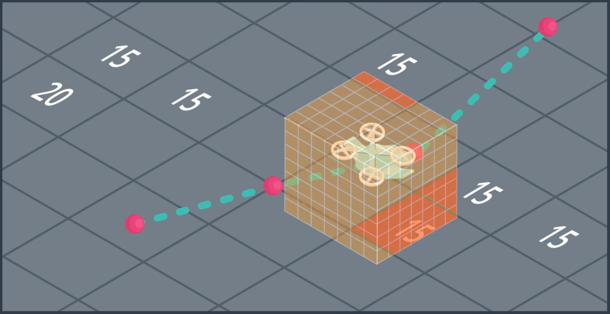

# AAE_Notebook_014_RedingHorizon
As mentioned in the previous notebook on probabilistic roadmaps, a precise map of the entire 3D state space can be quite computationally expensive and, often times, unnecessary.

In this notebook, we're going to explore the concept of having a receding horizon. That is to say, using the global map as a rough estimate from start state to goal state whilst implementing a more precise local map.

Generally speaking, in most 3D environments, we're always going to have a decent portion of static obstacles around which to plan our path; however, there will exist a degree of dynamic obstacles as well. 

In example, consider a cityscape, or even a single block of that cityscape. Given a map of the city, we're able to determine a general path from start state to goal state; however, considering our single block... Let's say that you are traversing from an initial intersection to the next. The overall, global, map only takes into account the neighboring obstacles such as buildings, landmarks, etc. This gives our general path. However, from intersection to intersection, we may come across vehicles, pedestrians, etc (dynamic obstacles).

The inprecise estimate given by the global map need only be computed once, as buildings don't, typically, topple over at random or decide to shift themselves to the middle of the street. Though, in contending with the dynamic obstacles along our route, we're going to need to construct a more precise, local map with some given resolution and diameter.

(Such a local map and planning phase could also help compensate for such outside disturbances such as wind, sensor imprecision/drift, etc.)

Note: the constraints of the local map and planner are reliant on the constraints of the cpu of your flight computer, given flight speed, etc.
